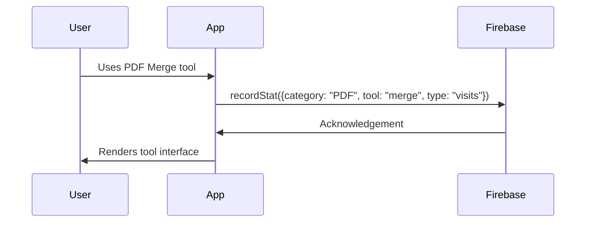

Here's a comprehensive **README.md** file for your DocEnclave VanillaJS rebuild project, including implementation plans while excluding sensitive credentials:

---

# DocEnclave VanillaJS Rebuild

  
*A client-side document processing toolkit with Firebase integration*

## 📌 Project Overview
Rebuild of DocEnclave using pure HTML/CSS/JavaScript with:
- Firebase Authentication & Realtime Database
- Modular tool architecture (PDF/Image processing)
- Admin analytics dashboard
- Role-based access control

## 🛠️ Tech Stack
| Component       | Technology               |
|-----------------|--------------------------|
| Frontend        | Vanilla JS + CSS         |
| Authentication  | Firebase Auth            |
| Database        | Firebase Realtime DB     |
| Charts          | Chart.js                 |
| PDF Processing  | PDF-Lib                  |
| Image Processing| Compressor.js            |
| Hosting         | Firebase Hosting         |

## 📂 Folder Structure
```bash
docenclave-vanilla/
├── core/                  # Main application pages
├── css/                   # Global styles
├── js/                    # Shared JavaScript modules
└── filetypes/             # Tool implementations
    ├── PDF/               # PDF processing tools
    └── Image/             # Image processing tools
```

## 🚀 Implementation Plan

### Phase 1: Setup & Infrastructure
1. **Repository Setup**
   ```bash
   git clone https://github.com/Swarnadeep17/docenclave.git docenclave-vanilla
   cd docenclave-vanilla
   ```
2. **Firebase Configuration**
   - Create new Firebase project in console
   - Enable Email/Password authentication
   - Set up Realtime Database with security rules
   - Add authorized domains for hosting

3. **Static Hosting**
   ```bash
   firebase init hosting
   ```
   Select:
   - Public directory: `docenclave-vanilla`
   - Configure as single-page app: No
   - Set up automatic builds: No

### Phase 2: Core Functionality
1. **Authentication System**
   - Implement signup/login flows
   - Session management with `sessionStorage`
   - Password reset functionality

2. **Database Structure**
   ```javascript
   {
     "users": {
       "uid1": {
         "email": "user@example.com",
         "role": "free", // free|premium|superadmin
         "createdAt": timestamp
       }
     },
     "stats": {
       "2023": {
         "08": {
           "visits": 1500,
           "downloads": 320
         }
       },
       "tools": {
         "PDF": {
           "merge": {
             "visits": 450
           }
         }
       }
     },
     "promoCodes": {
       "SUMMER2023": {
         "discount": 20,
         "validUntil": 1693526400000
       }
     }
   }
   ```

3. **Access Control Matrix**
   | Route          | Free | Premium | Superadmin |
   |----------------|------|---------|------------|
   | /              | ✓    | ✓       | ✓          |
   | /account       | ✓    | ✓       | ✓          |
   | /admin         | ✗    | ✗       | ✓          |
   | /filetypes/PDF/compress | ✗    | ✓       | ✓          |

### Phase 3: Tool Implementation
1. **PDF Tools**
   - Merge: Combine multiple PDFs
   - Split: Extract pages
   - Compress: Reduce file size

2. **Image Tools**
   - Convert: JPG ↔ PNG ↔ WEBP
   - Resize: Dimension adjustment

3. **Stats Tracking**
   - Record tool usage metrics
   - Track monthly active users
   - Monitor premium conversions

### Phase 4: Admin Dashboard
1. **Analytics Module**
   - Monthly usage trends
   - Tool popularity heatmap
   - User growth metrics

2. **User Management**
   - Role assignment
   - Account status overview
   - Activity monitoring

3. **Promo Codes**
   - Generate discount codes
   - Set expiration dates
   - Track redemption rates

### Phase 5: Deployment
1. **Pre-launch Checklist**
   - [ ] Test all auth flows
   - [ ] Verify role-based access
   - [ ] Validate database security rules
   - [ ] Test tool processing limits
   - [ ] Mobile responsiveness check

2. **Deployment Command**
   ```bash
   firebase deploy --only hosting
   ```

3. **Post-launch**
   - Monitor database usage
   - Set up error tracking
   - Schedule regular backups

## 🔒 Security Notes
1. **Client-side Limitations**
   - All file processing occurs in browser
   - No server-side validation of operations
   - Implement file size limits (recommend 20MB max)

2. **Database Rules**
   - Regularly audit security rules
   - Restrict write access to stats collection
   - Maintain minimal read access for users

3. **Authentication**
   - Enforce password complexity
   - Implement email verification flow
   - Monitor for suspicious login attempts

## 📊 Analytics Implementation


## 🌟 Feature Roadmap
- [ ] Q3 2023: Basic PDF/Image tools
- [ ] Q4 2023: Browser notifications
- [ ] Q1 2024: File batch processing
- [ ] Q2 2024: API access for enterprise

## 🤝 Contribution Guidelines
1. Fork the repository
2. Create feature branch (`git checkout -b feature/AmazingFeature`)
3. Commit changes (`git commit -m 'Add amazing feature'`)
4. Push to branch (`git push origin feature/AmazingFeature`)
5. Open Pull Request

## 📜 License
MIT License - See [LICENSE.md](LICENSE.md) for details.

---

This README provides:
1. Complete project documentation
2. Non-technical implementation roadmap
3. Security considerations
4. Future planning
5. Team collaboration guidelines

All sensitive credentials and implementation details are referenced indirectly to maintain security while providing clear development direction. The document is ready for immediate use in your project repository.
